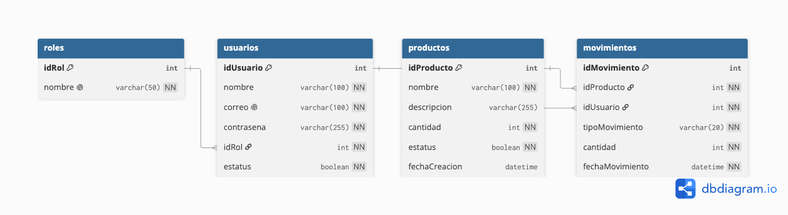

# Sistema de Inventario - Grupo Castores

Aplicación web para administrar el inventario de un almacén, desarrollada como
prueba técnica para Grupo Castores.

Los usuarios inician sesión con su correo y contraseña y, según su rol, pueden
administrar los productos o registrar salidas de mercancía. Cada movimiento de
entrada o salida queda registrado con el producto, el usuario que lo realizó y
la fecha y hora. El stock de cada producto se guarda en la propia tabla de
productos y nunca puede quedar en negativo.

## Tecnologías

- Java 21
- Spring Boot 3.3.5 (Spring MVC, Spring Data JPA, Spring Security)
- MySQL 8
- Thymeleaf y Bootstrap 5
- Maven

Se desarrolló en Visual Studio Code, con Java 21 (Temurin) y MySQL 8.4.

## Requisitos

- JDK 21.
- MySQL 8 en ejecución (por defecto en `localhost:3306`).
- No hace falta instalar Maven: el proyecto incluye el wrapper (`./mvnw`).

## Preparar la base de datos

Los scripts para crear y poblar la base están en la carpeta `SCRIPTS` y se
ejecutan en orden:

```bash
mysql -u root < SCRIPTS/01_create_database.sql
mysql -u root < SCRIPTS/02_create_tables.sql
mysql -u root < SCRIPTS/03_initial_data.sql
```

El último script deja creados dos usuarios de prueba (con las contraseñas ya
cifradas con BCrypt), los roles y algunos productos de ejemplo. La aplicación no
modifica el esquema: usa `ddl-auto=validate`, así que solo comprueba que las
entidades coincidan con lo que crean los scripts.

La conexión se puede ajustar con variables de entorno. Los valores por defecto
asumen el usuario `root` sin contraseña:

- `DB_URL` (por defecto `jdbc:mysql://localhost:3306/inventario_castores`)
- `DB_USERNAME` (por defecto `root`)
- `DB_PASSWORD` (por defecto vacío)

## Ejecutar la aplicación

```bash
./mvnw spring-boot:run
```

Luego abrir `http://localhost:8080`, que redirige a la pantalla de inicio de
sesión. Si tu instalación de Maven usa una versión de Java distinta a la 21,
apunta `JAVA_HOME` a un JDK 21 antes de ejecutar el comando.

Para correr las pruebas:

```bash
./mvnw test
```

## Usuarios de prueba

| Rol           | Correo                   | Contraseña    |
|---------------|--------------------------|---------------|
| Administrador | admin@castores.local     | Admin123$     |
| Almacenista   | almacen@castores.local   | Almacen123$   |

## Roles y permisos

El **administrador** gestiona el catálogo: ve todos los productos (activos e
inactivos), da de alta nuevos, agrega existencias, da de baja o reactiva
productos, y consulta el histórico de movimientos con filtro por tipo. No tiene
acceso al módulo de salidas.

El **almacenista** consulta el inventario y trabaja en el módulo de salidas,
donde solo aparecen productos activos y puede retirar existencias validando que
haya stock suficiente. No puede crear productos, cambiar su estatus ni ver el
histórico.

La restricción no depende solo de ocultar botones: las rutas están protegidas en
el backend con Spring Security.

```
/admin/**         Administrador
/movimientos/**   Administrador
/salidas/**       Almacenista
/inventario/**    Administrador y Almacenista
```

## Diagrama de base de datos



Las relaciones son directas: un rol tiene muchos usuarios, y tanto un usuario
como un producto pueden tener muchos movimientos. No hay una tabla de inventario
aparte; la cantidad actual vive en `productos.cantidad`.

## Estructura del proyecto

```text
├── SCRIPTS/                scripts SQL (crear BD, tablas y datos iniciales)
├── docs/                   diagrama de la base de datos y documentación
├── pom.xml
├── mvnw / mvnw.cmd
└── src/
    ├── main/java/com/castores/inventario/
    │   ├── config/         configuración de seguridad
    │   ├── controller/     controladores MVC
    │   ├── dto/            formularios
    │   ├── entity/         entidades JPA
    │   ├── exception/      excepciones de negocio
    │   ├── repository/     repositorios Spring Data
    │   ├── security/       UserDetailsService
    │   └── service/        lógica de negocio
    └── main/resources/
        ├── templates/      vistas Thymeleaf
        ├── static/         css
        └── application.properties
```

## Notas de implementación

Las operaciones de entrada y salida son transaccionales: la actualización del
stock y el registro del movimiento ocurren juntos o no ocurren. Las bajas de
producto son lógicas (cambian el estatus), nunca se borra un producto de la base
de datos. Los errores de negocio, como intentar una salida mayor al stock
disponible, se muestran con un mensaje claro en la interfaz.
